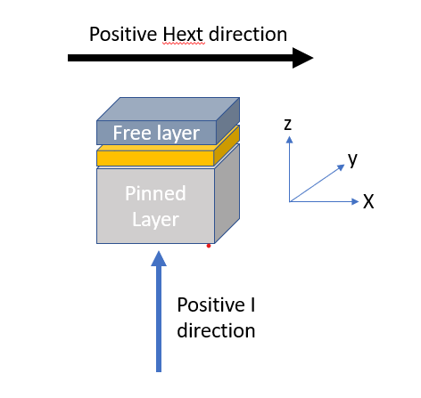

# Nanospintronics_LLG_STT
Created as part of the course Nanospintronics (3MN220) at the technical University of Eindhoven (TUE)
- Authors: R.M.P. Teunissen, R.F.J. van Haren
- Date last updated: May 2023

## About this project
The code of this file has been written as part of the course Nanospintronics at the TUE 

The system at hand consists of: 

The coordinate system is define by:

## Files and necessities
This project consists of multiple files each with their purpose:
- main.py .... 
- .....py can be run to ....
- .....py constains a series of relevant functions
- .
