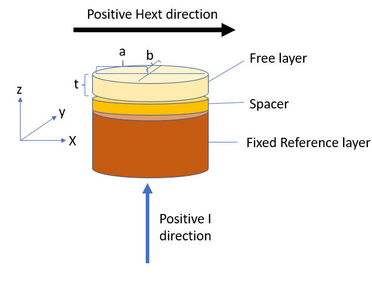

# Nanospintronics_LLG_STT
Created as part of the course Nanospintronics (3MN220) at the technical University of Eindhoven (TUE)
- Authors: R.M.P. Teunissen, R.F.J. van Haren
- Date last updated: June 2023

## About this project
The code of this file has been written as part of the course Nanospintronics at the TUE (Einhoven, Netherlands).
The code in this project can be used to simulate the dynamics of MRAM bits according to the LLG equation, create phase 
diagrams showing the dynamic type for various field and current, add a custom current shape.

The system at hand consists of a thin nanopillar consisting of a thick "pinned" ferromagnetic layer 
followed by a thin conducting layer and a thin "free" ferromagnetic layer.
The exact stack composition is:

Cu(80nm)/Co(40nm)/Cu(thin)/Co(3nm)/Cu(10nm)

The coordinate system is define by (positive direction of Hext is opposite):

Most of the phenomological constants used in this repository are copied from: DOI: [10.1103/PhysRevB.72.014446]

## About the model:
The model we use solves the dynamics of the system under the effective of and effective field and a sine like-slowensci spin transfer torque.
We take a macrospin approach where the entire magnetic layer is assumed to be so small that the magnetization of the layer will rotate as a whole.
Things which are included are:
- Precession and damping around/towards an effective field consisting of:
  - An external magnetic field
  - A demagnetization field for a thin elliptical cylinder (=shape anisotropy)
  - A surface anisotropy 
  - A stochastic temperature field
- Symmetric slowensci spin transfer torque 

## About the Files and using this code
This project consists of multiple files each with their purpose, the most important ones are:
- LLG_solver: contains all important functions for solving the LLG equation, can also be run on its own to investigate the dynamics at given input parameters
- Phase_diagram.py: Can be run to create a phase diagram of the system. It does so by simulaating the LLG equation for various strenghts of the input current and field and after a while looking at the state the system is in. Alyternatively one can also set ... to TRUE to get a phase diagram showing the maximum angle achieved during the precession to e.g. investigate the effect of AC currents

other files we used for testing:
- speed_test.py: can be run to analyse the time needed for any function and its subfunctions to run, nice for speed analysis
- Temp_histogram: can be run to check whether the stochastic field will eventually produce a boltzman distribution, note that in order for this to work, we must MANUALLY set the demag_tensor to np.array([0,0,0]) in the LLG_solver 
